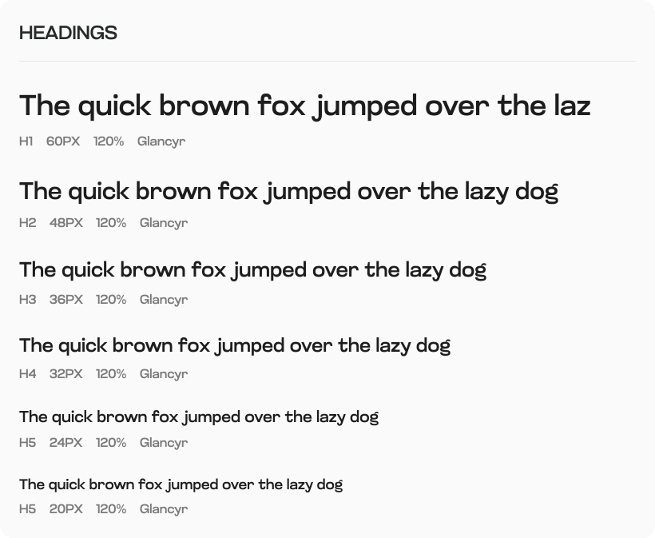
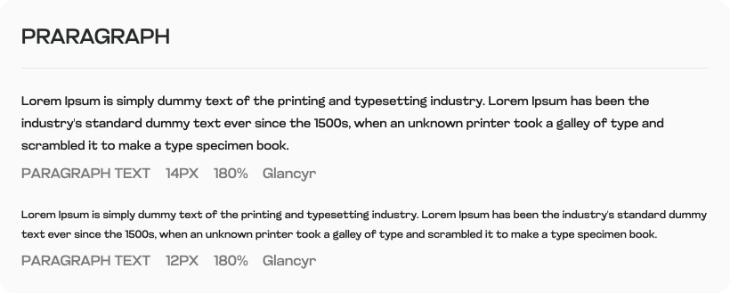
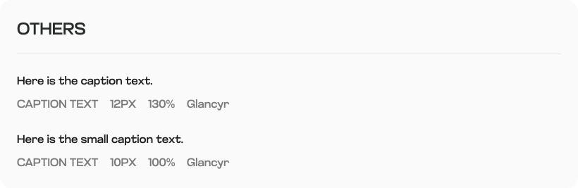

# Brand Kit

***

## Solayer Logo's

[Download Full Kit here](https://drive.google.com/drive/folders/1M8zgoynHuX7ynXzG4JuQW50l7QA333NJ?usp=drive\_link)

<table data-view="cards"><thead><tr><th></th><th></th><th></th><th data-hidden data-card-cover data-type="files"></th></tr></thead><tbody><tr><td>Solayer Logomark - Green  <a href="https://drive.google.com/file/d/1dHVCaSKcEkShAEZFXrVUuUPaS2jZUQ1C/view?usp=drive_link">JPG</a>   <a href="https://drive.google.com/file/d/1IuCakJDZrPMSHSfoe_iYUSv6lgG4brZ5/view?usp=drive_link">PNG</a>   <a href="https://drive.google.com/file/d/1kDgX6aw_JKaRdoE8HE6JsXkrkY-9phFm/view?usp=drive_link">SVG</a>    </td><td></td><td></td><td><a href=".gitbook/assets/Solayer Logomark - Green (1).svg">Solayer Logomark - Green (1).svg</a></td></tr><tr><td>Solayer Logomark - White  <a href="https://drive.google.com/file/d/1uvzmrTpT-4N2OVoioHJu3zH7HVYjxNlp/view?usp=drive_link">JPG</a>   <a href="https://drive.google.com/file/d/1FhpJriDj4dSOBXsSlYv8_M3od8VhJ2pS/view?usp=drive_link">PNG</a>   <a href="https://drive.google.com/file/d/1ENiAp2uvIORq2G7NBf4bc7h5Ri3_342P/view?usp=drive_link">SVG</a> </td><td></td><td></td><td><a href=".gitbook/assets/Solayer Logomark - White (1).svg">Solayer Logomark - White (1).svg</a></td></tr><tr><td>Solayer Logomark -  Dark  <a href="https://drive.google.com/file/d/1zgwiAndxaxy_JcgoOrspBogKj-I3t2IX/view?usp=drive_link">JPG</a>   <a href="https://drive.google.com/file/d/1AyqLkCZYJzQh02fU32T0_31oJDG93lxl/view?usp=drive_link">PNG</a>   <a href="https://drive.google.com/file/d/1DSn6E3JjL3ch3skq6TyeZtqQjG2S_iWc/view?usp=drive_link">SVG</a> </td><td></td><td></td><td><a href=".gitbook/assets/Solayer Logomark - Dark (1).svg">Solayer Logomark - Dark (1).svg</a></td></tr><tr><td>Solayer Wordmark - Green  <a href="https://drive.google.com/file/d/1IgixrtGwB5Rs5ZllmR06fJNokF0L7Mz1/view?usp=drive_link">JPG</a>   <a href="https://drive.google.com/file/d/10AgIYaYQieJ2w7FG3iqx9v2KTRUPllog/view?usp=drive_link">PNG</a>   <a href="https://drive.google.com/file/d/1yvzOyPWhV2HKyc5yu24JLG0yBlHtX7iR/view?usp=drive_link">SVG</a>  </td><td></td><td></td><td><a href=".gitbook/assets/Solayer Wordmark - Green (1).svg">Solayer Wordmark - Green (1).svg</a></td></tr><tr><td>Solayer Wordmark - White  <a href="https://drive.google.com/file/d/1k-1J3y7CKtJTWx85HeUL9PmONDznq_4x/view?usp=drive_link">JPG</a>   <a href="https://drive.google.com/file/d/1h5ZQRt8b2afZz_GwN_k0an7L4T2CpUB7/view?usp=drive_link">PNG</a>   <a href="https://drive.google.com/file/d/1pcE6I-_7Lg9eCVdeL1jJuXlm51DjuiWl/view?usp=drive_link">SVG</a> </td><td></td><td></td><td><a href=".gitbook/assets/Solayer Wordmark - White (1).svg">Solayer Wordmark - White (1).svg</a></td></tr><tr><td>Solayer Wordmark - Dark  <a href="https://drive.google.com/file/d/17Ki9p6ZXT46v_b5Aaeh5wZ54rl5xLkhR/view?usp=drive_link">JPG</a>   <a href="https://drive.google.com/file/d/1AlbnnxL9TRKwOMFiAu2SQTNe2rLgDl-K/view?usp=drive_link">PNG</a>   <a href="https://drive.google.com/file/d/1wFve0FU00kpAu9AXn9vyhcG1RcKzGDfm/view?usp=drive_link">SVG</a> </td><td></td><td></td><td><a href=".gitbook/assets/Solayer Wordmark - Dark (1).svg">Solayer Wordmark - Dark (1).svg</a></td></tr><tr><td>Solayer Fulllogo - Green  <a href="https://drive.google.com/file/d/1dRRC1ppEIK2AGbHip3CF8G-6f8PgyaYU/view?usp=drive_link">JPG</a>   <a href="https://drive.google.com/file/d/19hhbhAmy9Xj79PZcKNeHIBzP-SXGjoB6/view?usp=drive_link">PNG</a>   <a href="https://drive.google.com/file/d/1yy_UsPVWTr6tJmZEBmQ2dmcfBPn8Ts7S/view?usp=drive_link">SVG</a> </td><td></td><td></td><td><a href=".gitbook/assets/Solayer Fulllogo - Green (1).svg">Solayer Fulllogo - Green (1).svg</a></td></tr><tr><td>Solayer Fulllogo - White  <a href="https://drive.google.com/file/d/18NGH0pUtz6_i02RC-3ocOarPoF6BYjh-/view?usp=drive_link">JPG</a>   <a href="https://drive.google.com/file/d/178BBMS7deuBOsVDEylDbslQ7rkkEALcZ/view?usp=drive_link">PNG</a>   <a href="https://drive.google.com/file/d/1JgkTI9V_vPnv9C_0QTbdpffRf-EINv2F/view?usp=drive_link">SVG</a> </td><td></td><td></td><td><a href=".gitbook/assets/Solayer Fulllogo - White (1).svg">Solayer Fulllogo - White (1).svg</a></td></tr><tr><td>Solayer Fulllogo - Dark  <a href="https://drive.google.com/file/d/1ycjNEzIpxmMs95wJwjH3l2TWQRtzgInn/view?usp=drive_link">JPG</a>   <a href="https://drive.google.com/file/d/1A0MAfNPLQFehmzV1UKlzbrwms9rsj0ez/view?usp=drive_link">PNG</a>   <a href="https://drive.google.com/file/d/11_oPXs9cQD8tizvlYrDwLusnv78uwfup/view?usp=drive_link">SVG</a> </td><td></td><td></td><td><a href=".gitbook/assets/Solayer Fulllogo - Dark (1).svg">Solayer Fulllogo - Dark (1).svg</a></td></tr></tbody></table>

***

## Colors

<table data-view="cards"><thead><tr><th></th><th></th><th></th><th data-hidden data-card-cover data-type="files"></th></tr></thead><tbody><tr><td>Primary <a href="https://symbolonly.com/dot-symbols.html">•</a> #084D3E</td><td></td><td></td><td><a href=".gitbook/assets/PRIMARY.svg">PRIMARY.svg</a></td></tr><tr><td>White <a href="https://symbolonly.com/dot-symbols.html">•</a> #FFFFFF</td><td></td><td></td><td><a href=".gitbook/assets/WHITE.svg">WHITE.svg</a></td></tr><tr><td></td><td></td><td></td><td></td></tr></tbody></table>

***

<table data-view="cards"><thead><tr><th></th><th></th><th></th><th data-hidden data-card-cover data-type="files"></th></tr></thead><tbody><tr><td>LG4 <a href="https://symbolonly.com/dot-symbols.html">•</a> #638F85</td><td></td><td></td><td><a href=".gitbook/assets/LG4 (1).svg">LG4 (1).svg</a></td></tr><tr><td>LG3 <a href="https://symbolonly.com/dot-symbols.html">•</a> #90AFA8</td><td></td><td></td><td><a href=".gitbook/assets/LG3 (1).svg">LG3 (1).svg</a></td></tr><tr><td>LG2 <a href="https://symbolonly.com/dot-symbols.html">•</a> #BED0CC</td><td></td><td></td><td><a href=".gitbook/assets/LG2 (1).svg">LG2 (1).svg</a></td></tr><tr><td>LG1 <a href="https://symbolonly.com/dot-symbols.html">•</a> #D0E1DE</td><td></td><td></td><td><a href=".gitbook/assets/LG1 (1).svg">LG1 (1).svg</a></td></tr></tbody></table>

***

<table data-view="cards"><thead><tr><th></th><th></th><th></th><th data-hidden data-card-cover data-type="files"></th></tr></thead><tbody><tr><td>Grey 5 <a href="https://symbolonly.com/dot-symbols.html">•</a> #262A29</td><td></td><td></td><td><a href=".gitbook/assets/GREY5 (1).svg">GREY5 (1).svg</a></td></tr><tr><td>Grey 4 <a href="https://symbolonly.com/dot-symbols.html">•</a> #6F7574</td><td></td><td></td><td><a href=".gitbook/assets/GREY4 (1).svg">GREY4 (1).svg</a></td></tr><tr><td>Grey 3 <a href="https://symbolonly.com/dot-symbols.html">•</a> #929796</td><td></td><td></td><td><a href=".gitbook/assets/GREY3 (1).svg">GREY3 (1).svg</a></td></tr><tr><td>Grey 2 <a href="https://symbolonly.com/dot-symbols.html">•</a> #BEC2C1</td><td></td><td></td><td><a href=".gitbook/assets/GREY2 (1).svg">GREY2 (1).svg</a></td></tr><tr><td>Grey 1 <a href="https://symbolonly.com/dot-symbols.html">•</a> #D2D6D5</td><td></td><td></td><td><a href=".gitbook/assets/GREY1 (1).svg">GREY1 (1).svg</a></td></tr></tbody></table>

***

<table data-view="cards"><thead><tr><th></th><th></th><th></th><th data-hidden data-card-cover data-type="files"></th></tr></thead><tbody><tr><td>Error <a href="https://symbolonly.com/dot-symbols.html">•</a> #E34935</td><td></td><td></td><td><a href=".gitbook/assets/error.svg">error.svg</a></td></tr><tr><td>Warning <a href="https://symbolonly.com/dot-symbols.html">•</a> #B38600</td><td></td><td></td><td><a href=".gitbook/assets/Warning.svg">Warning.svg</a></td></tr><tr><td>Success <a href="https://symbolonly.com/dot-symbols.html">•</a> #22A06B</td><td></td><td></td><td><a href=".gitbook/assets/Success.svg">Success.svg</a></td></tr></tbody></table>

***

## Typography

<figure><figcaption></figcaption></figure>

<figure><figcaption></figcaption></figure>

<figure><figcaption></figcaption></figure>

<figure><figcaption></figcaption></figure>
