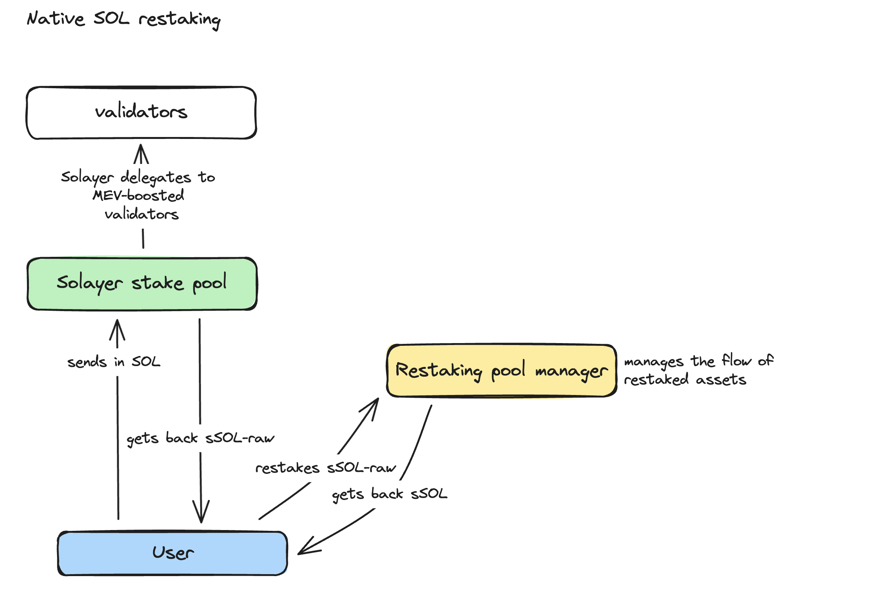

# LST Restaking

As of April 1st, 2024, a significant portion of Solana's tokens is participating in liquid staking, a critical component of its restaking layer. Specifically, $2.29 billion worth of SOL has been liquid staked. This figure represents approximately 4.3% of Solana's total circulating value of $53 billion.&#x20;

**The liquid staked tokens Solayer is including at launch for restaking:**

Marinade-SOL (mSOL)\
JITO-SOL (JITO-SOL)\
Blaze-SOL (bSOL)\
MarginFi-SOL (mSOL)

Solayer will monitor for other potential LSTs to be added into the restaking bucket. Please reach out to _team@solayer.org_ if there is room for collaboration.&#x20;

Any assets deposited into Solayer will be matched with an equivalent SPL token, denoted by an 's-' in its symbol. Collectively, we call them Solayer assets. Initially, these tokens won't be transferable as this helps in calculating points for the liquidity reward program. However, they will become transferable in the future. Apart from ‌native SOL, all other assets won't have any unbounding lockups.

Unlike Eigenlayer, which implements the unbonding process when assets are first converted to restaked assets, the AVS unbonding process is a separate step for Solayer. Solayer offers more flexibility for the AVSs on our SVN, allowing them to design their own unbounding process with a maximum unbounding period of 14 days. Solayer also provides an emergency exit mechanism to release the bound stake from users should the AVS cease to function.

The second phase of our protocol development will enable users to pledge their Solayer assets to secure additional networks by delegating  them to a Solayer operator responsible for managing the AVS nodes. Should an operator engage in malicious behavior, they will be subject to penalties, resulting in a potential loss of the user's deposit. Consequently, users must exercise caution when selecting operators to delegate to, ensuring that they possess a trustworthy track record and fulfill the requisite criteria of the AVS.

Diverging from Eigenlayer's model, which restricts AVS selection to either native staking or Liquid Staking Tokens (LSTs), Solayer offers a more versatile approach. It empowers AVS developers to tailor their security measures according to their specific needs.&#x20;

### &#x20;Step-by-step guide to LST restaking&#x20;

**Step 1:** Navigate to app.solayer.org&#x20;

<figure><figcaption></figcaption></figure>

**Step 2:** Select which LST you would like to restake&#x20;

<figure><figcaption></figcaption></figure>

**Step 3**: Enter the amount you would like to restake for token approval

**Step 4**: Confirm deposit &#x20;

**Step 5**: Points will begin to accrue at the point of restaking&#x20;

**Step 6**: At a given point of withdrawal, a portion of the points will be penalized before the launch of node operators&#x20;
